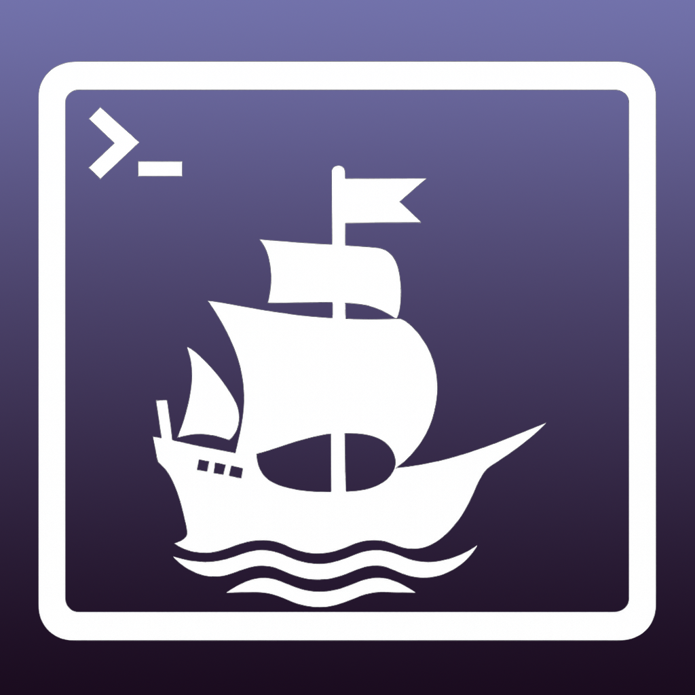
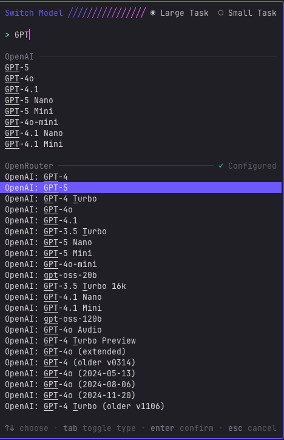

# Victoria Terminal



Victoria is Elcano's AI agent for navigating programmatic advertising datasets. Traders can ask natural-language questions of CSVs, Excel workbooks, and SQL-queryable sources to surface insights, spot trends, and optimize campaigns without leaving the terminal.

---

## 🔐 Security & Licensing at a Glance

- **Container-first distribution.** Victoria ships as a Podman image that packages Python, `uv`, the `crush` CLI, and all dependencies. Running in a container isolates the agent from the host OS while still allowing controlled file sharing via `~/Victoria`.
- **Secrets stay in your workspace.** Credentials are written to `~/Victoria/.env`, mounted into the container at runtime. The entry point can regenerate or update this file without embedding secrets in the image.
- **Transparent builds.** GitHub Actions automatically builds and publishes the container to `ghcr.io/elcanotek/victoria-terminal`, ensuring every release is reproducible and verified in CI.
- **Open, source-available code.** The repository is available for review and contribution under the [Elastic License 2.0](LICENSE), so teams can audit changes and collaborate while retaining commercial protections.

---

## 🚀 Quick Start for Analysts & Traders

Follow these steps if you primarily want to run Victoria to analyze advertising data.

### 1. Install Podman

Victoria relies on Podman for containerized execution. Install it from [podman.io](https://podman.io) or your system's package manager before proceeding.

### 2. Prepare the shared workspace

Create the directory that the container will use to share configuration and project files with your host operating system:

* **macOS / Linux**
  ```bash
  mkdir -p ~/Victoria
  ```
* **Windows (PowerShell)**
  ```powershell
  New-Item -ItemType Directory -Path "$HOME/Victoria" -Force
  ```
* **Windows (Command Prompt)**
  ```cmd
  mkdir %USERPROFILE%\Victoria
  ```

### 3. Launch Victoria Terminal

Run the latest published container, mounting the shared directory you created above:

```bash
podman run --rm -it \
  -v ~/Victoria:/root/Victoria \
  ghcr.io/elcanotek/victoria-terminal:latest
```

> [!TIP]
> On Arm64 hardware (for example, Apple silicon Macs), pull the architecture-specific image:
> ```bash
> podman run --rm -it \
>   -v ~/Victoria:/root/Victoria \
>   ghcr.io/elcanotek/victoria-terminal:latest-arm64
> ```
> Commit-specific tags with the `-arm64` suffix are also published if you need to pin to an exact build.

To pass command-line options directly to the entry point script (`victoria_entrypoint.py`), append them after a `--` separator:

```bash
podman run --rm -it \
  -v ~/Victoria:/root/Victoria \
  ghcr.io/elcanotek/victoria-terminal:latest -- --course 2
```

### 4. Configure on first run

The container entry point (`victoria_entrypoint.py`) guides the initial setup:

- If it detects configuration files in `~/Victoria`, it reuses them automatically.
- Otherwise it prompts for essentials—OpenRouter API keys and optional Snowflake credentials—and saves them to `~/Victoria/.env`.

Re-run the configuration wizard at any time without launching the UI:

```bash
podman run --rm -it \
  -v ~/Victoria:/root/Victoria \
  ghcr.io/elcanotek/victoria-terminal:latest -- --reconfigure --skip-launch
```

You can also point the entry point at an alternate shared location with `--shared-home /path/to/shared/Victoria`.

### 5. Choose an AI model in Crush

When testing **Victoria** in the terminal, we recommend the following models. They have been vetted for compatibility, reliability, and cost.

| **Model Name**           | **How It Appears in Crush (under ✅ Configured)** |
|-------------------------|---------------------------------------------------|
| ChatGPT 5               | `OpenAI: GPT-5`                                   |
| ChatGPT 5 Mini          | `OpenAI: GPT-5 Mini`                              |
| xAI Grok Code Fast 1    | `xAI: Grok Code Fast 1`                           |
| Google Gemini 2.5 Pro   | `Google: Gemini 2.5 Pro`                          |
| Google Gemini 2.5 Flash | `Google: Gemini 2.5 Flash`                        |

**Selecting a model:**

1. Launch Victoria in your terminal.
2. Press **`Ctrl+P`** to open the command menu.
3. Choose **“Select Model.”**
4. Use the search bar to find a recommended model (for example, type `GPT-5` or `Gemini 2.5`).
5. Under the **✅ Configured** heading, pick one of the models from the table above.

<p align="left">
  
</p>

> [!NOTE]
> - These five models are the only ones approved for Victoria at this time.
> - Selecting a model outside this list is unsupported and may produce unreliable results.
> - Victoria remembers the last model you selected and loads it automatically on the next launch.
> - To compare results across models, switch models and **restart Victoria** so each model begins with a fresh context.

---

## 🛠️ Developer & Contributor Guide

Follow this path if you plan to modify Victoria or run the automated tests.

### Clone the repository and set up a virtual environment

```bash
git clone https://github.com/elcanotek/victoria.git
cd victoria

uv venv
source .venv/bin/activate
uv pip install -r requirements-dev.txt
```

> You can use `python -m venv .venv` and `pip install -r requirements-dev.txt` instead of `uv` if preferred.

### Run tests on the host

With the virtual environment activated, execute the test suite:

```bash
pytest
```

### Build and test the container locally

Use Podman to build the development image and run commands inside it:

```bash
podman build -t victoria-terminal .

#optionally run pytest
podman run --rm -it \
  victoria-terminal pytest

#run the terminal agent
podman run --rm -it \
  -v ~/Victoria:/root/Victoria \
  victoria-terminal
```

Both approaches share the same source tree and configuration files stored in `~/Victoria`.

### Continuous delivery pipeline

Every push to `main` triggers a GitHub Actions workflow that rebuilds the Podman image and publishes it to `ghcr.io/elcanotek/victoria-terminal`. The published image is what production users run, so CI keeps dependencies and CLI tooling up to date.

---

## 🤝 Contributing

We welcome contributions to Victoria! Review our [Contributing Guidelines](CONTRIBUTING.md) for code style, testing expectations, and the pull-request process.

