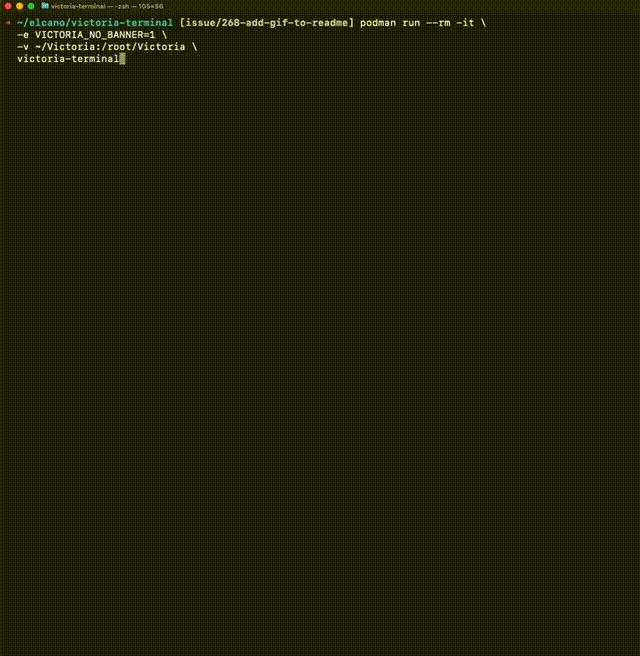

# Victoria Terminal




Victoria is Elcano's AI agent for navigating programmatic advertising datasets. Traders can ask natural-language questions of CSVs, Excel workbooks, and SQL-queryable sources to surface insights, spot trends, and optimize campaigns without leaving the terminal.

---

## 🔐 Security & Licensing at a Glance

- **Container-first distribution.** Victoria ships as a Podman image that packages Python, the `crush` CLI, and all dependencies. Running in a container isolates the agent from the host OS while still allowing controlled file sharing via `~/Victoria`.
- **Secrets stay in your workspace.** Credentials are written to `~/Victoria/.env`, mounted into the container at runtime. The container's default command can regenerate or update this file without embedding secrets in the image.
- **Transparent builds.** GitHub Actions automatically builds and publishes the container to `ghcr.io/elcanotek/victoria-terminal`, ensuring every release is reproducible and verified in CI.
- **Open, source-available code.** The repository is available for review and contribution under the [Elastic License 2.0](LICENSE), so teams can audit changes and collaborate while retaining commercial protections.


## 🛠️ Prerequisites

Victoria requires a working Podman installation for every stream. Install and validate Podman before continuing with any setup path.

1. **macOS & Windows:** Download Podman Desktop from [podman.io](https://podman.io) for the fastest installation path.
2. **Linux:** Install Podman with your distribution's package manager to ensure it stays updated with system packages.
3. **Verify Podman works** by running `podman --version`. If you see a version number, you're ready to go.

---

## 🚀 Installation Streams

Victoria supports three installation flows depending on how much automation you want. Use the summary below to pick the path that matches your workflow, then jump to the detailed instructions.

| Stream | Best for | What you get |
| --- | --- | --- |
| [Stream 1 – Guided helper script](#stream-1--guided-helper-script) | Analysts and traders who want the quickest setup | Installs Podman prerequisites, provisions the shared workspace, pulls the right image, and adds a `victoria` command to your shell profile. |
| [Stream 2 – Manual Podman commands](#stream-2--manual-podman-commands) | Operators who prefer to copy/paste each command | Step-by-step Podman instructions for creating the workspace, pulling images, running the container, and passing options. |
| [Stream 3 – Build from source](#stream-3--build-from-source) | Contributors and teams customizing Victoria | Clone the repository, create a Python environment, and build/test the container locally. |

### Stream 1 – Guided helper script

Let Victoria wire up the remaining pieces for you. The helper scripts validate that Podman is ready, ensure your `~/Victoria` workspace exists, detect the host architecture (using `podman info` when available with a local fallback), pull the matching container image tag, and add a reusable `victoria` command to your shell profile.

* **macOS / Linux**
  ```bash
  curl -fsSL https://raw.githubusercontent.com/ElcanoTek/victoria-terminal/main/install_victoria.sh | bash
  ```
* **Windows (PowerShell)**
  ```powershell
  & ([scriptblock]::Create((irm 'https://raw.githubusercontent.com/ElcanoTek/victoria-terminal/main/install_victoria.ps1')))
  ```

After the helper finishes, open a new terminal session (or reload your profile with `source ~/.bashrc`, `source ~/.zshrc`, or `. $PROFILE`) and start Victoria with a single command:

```bash
victoria
```

Re-run the script any time you want to refresh the alias. It will not reinstall Podman for you, but it will remind you to start `podman machine` on macOS and Windows if needed.

### Stream 2 – Manual Podman commands

Prefer to copy/paste the commands yourself? Follow the steps below to mirror what the helper script does behind the scenes.

#### Create the shared workspace folder

Victoria stores configuration and credentials in a folder that is mounted into the container. Create it once and reuse it for every upgrade:

* **macOS / Linux**
  ```bash
  mkdir -p ~/Victoria
  ```
* **Windows (PowerShell)**
  ```powershell
  New-Item -ItemType Directory -Path "$HOME/Victoria" -Force
  ```
* **Windows (Command Prompt)**
  ```cmd
  mkdir %USERPROFILE%\Victoria
  ```

#### Pull the right image for your architecture

Victoria publishes multi-architecture tags. If you're unsure which CPU architecture your Podman host is using, check it with:

```bash
podman info --format '{{.Host.Arch}}'
```

Use the table below to pull (or update) the matching image and run it. Re-running the `podman pull` command keeps you on the latest release.

| Platform | CPU architecture | Pull / update | Run |
| --- | --- | --- | --- |
| macOS or Linux (Intel/AMD) | `x86_64` | `podman pull ghcr.io/elcanotek/victoria-terminal:latest` | `podman run --rm -it -v ~/Victoria:/root/Victoria ghcr.io/elcanotek/victoria-terminal:latest` |
| macOS or Linux (Arm64) | `arm64` | `podman pull ghcr.io/elcanotek/victoria-terminal:latest-arm64` | `podman run --rm -it -v ~/Victoria:/root/Victoria ghcr.io/elcanotek/victoria-terminal:latest-arm64` |
| Windows PowerShell (Intel/AMD) | `x86_64` | `podman pull ghcr.io/elcanotek/victoria-terminal:latest` | `podman run --rm -it -v "$env:USERPROFILE/Victoria:/root/Victoria" ghcr.io/elcanotek/victoria-terminal:latest` |
| Windows PowerShell (Arm64) | `arm64` | `podman pull ghcr.io/elcanotek/victoria-terminal:latest-arm64` | `podman run --rm -it -v "$env:USERPROFILE/Victoria:/root/Victoria" ghcr.io/elcanotek/victoria-terminal:latest-arm64` |

> [!NOTE]
> The run commands are shown on a single line to work in PowerShell and other shells without additional escaping. On macOS and Linux you can add `\` line continuations if you prefer.

On macOS and Linux you can split the run command across multiple lines for readability (the example below shows the `x86_64` tag; swap in the tag from the table above if you are on Arm64):

```bash
podman run --rm -it \
  -v ~/Victoria:/root/Victoria \
  ghcr.io/elcanotek/victoria-terminal:latest
```

To pass command-line options directly to the container's default command (`victoria_terminal.py`), append them after a `--` separator:

```bash
podman run --rm -it \
  -v ~/Victoria:/root/Victoria \
  ghcr.io/elcanotek/victoria-terminal:latest -- --reconfigure --skip-launch
```

Windows users should keep the commands on a single line and use `$env:USERPROFILE/Victoria` in place of `~/Victoria`.

#### Configure on first run

The container's default command (`victoria_terminal.py`) guides the initial setup:

- If it detects configuration files in `~/Victoria`, it reuses them automatically.
- Otherwise it prompts for essentials—OpenRouter API keys—and saves them to `~/Victoria/.env`.

Re-run the configuration wizard at any time without launching the UI:

```bash
podman run --rm -it \
  -v ~/Victoria:/root/Victoria \
  ghcr.io/elcanotek/victoria-terminal:latest -- --reconfigure --skip-launch
```

You can also point the default command at an alternate shared location with `--shared-home /path/to/shared/Victoria`.

> [!TIP]
> Swap in the image tag that matches your architecture (from the table above) and adjust the host path syntax for your platform. Windows PowerShell users should run the command on a single line with `$env:USERPROFILE/Victoria`.

### Stream 3 – Build from source

Follow this path if you plan to modify Victoria, integrate it into a custom workflow, or contribute changes upstream.

#### Clone the repository and set up a virtual environment

```bash
git clone https://github.com/ElcanoTek/victoria-terminal.git
# Or use SSH
git clone git@github.com:ElcanoTek/victoria-terminal.git
cd victoria-terminal

python -m venv .venv
source .venv/bin/activate
pip install -r requirements.txt
```

#### Run tests and linters on the host

With the virtual environment activated, run the automated checks via [Nox](https://nox.thea.codes/):

```bash
nox -s lint
nox -s tests
```

Both sessions create (and reuse) virtual environments so the commands can also be executed on a clean workstation without manually activating `.venv`. If you prefer to iterate inside the existing environment, you can still execute individual tools directly, for example `pytest` or `flake8`.

#### Build and test the container locally

Use Podman to build the development image and run commands inside it:

```bash
podman build -t victoria-terminal .

# optionally run pytest
podman run --rm -it \
  victoria-terminal pytest

# run the terminal agent
podman run --rm -it \
  -v ~/Victoria:/root/Victoria \
  victoria-terminal
```

Both approaches share the same source tree and configuration files stored in `~/Victoria`.

#### Continuous delivery pipeline

Every push to `main` triggers a GitHub Actions workflow that rebuilds the Podman image and publishes it to `ghcr.io/elcanotek/victoria-terminal`. The published image is what production users run, so CI keeps dependencies and CLI tooling up to date.

## 🤝 Contributing

We welcome contributions to Victoria! Review our [Contributing Guidelines](CONTRIBUTING.md) for code style, testing expectations, and the pull-request process.

