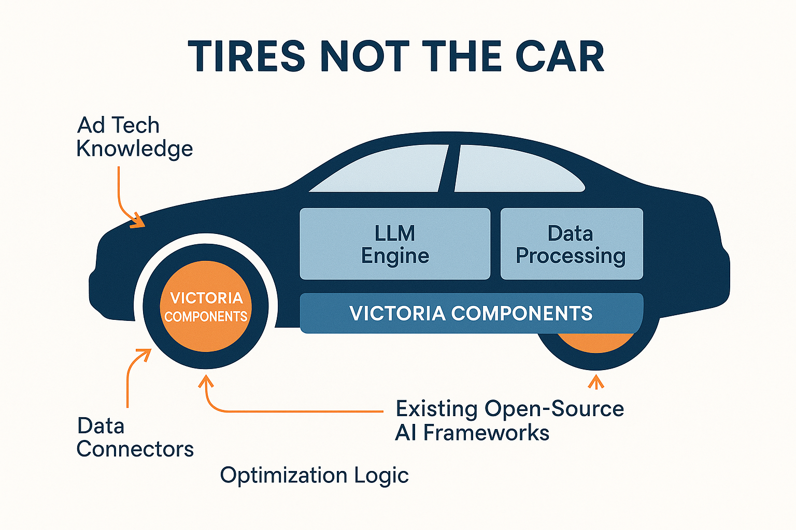
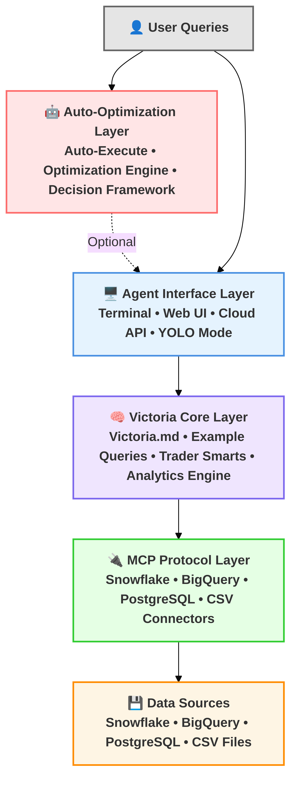
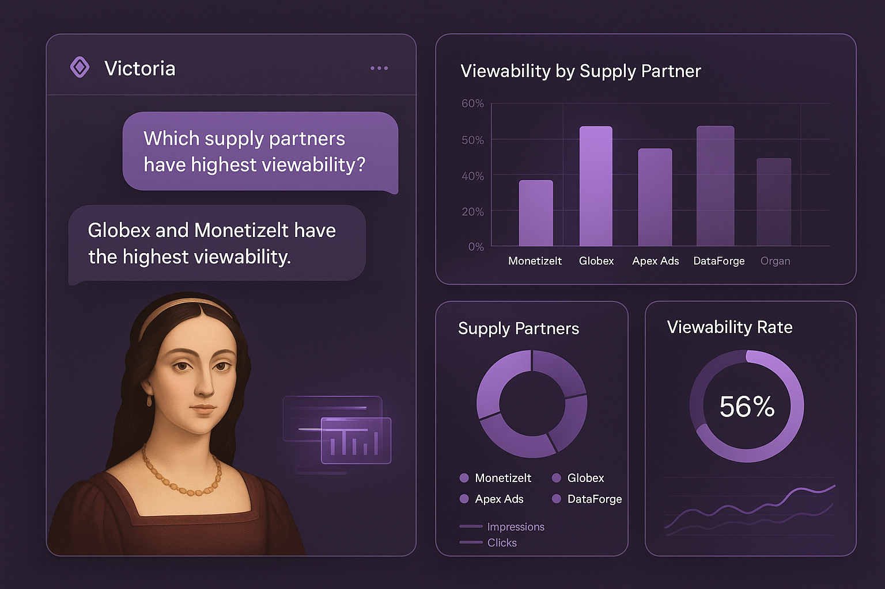
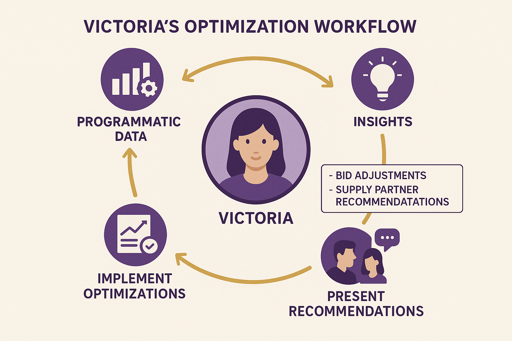
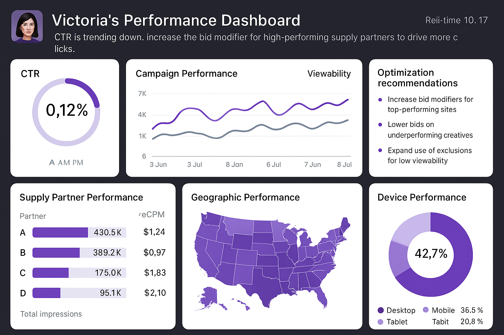
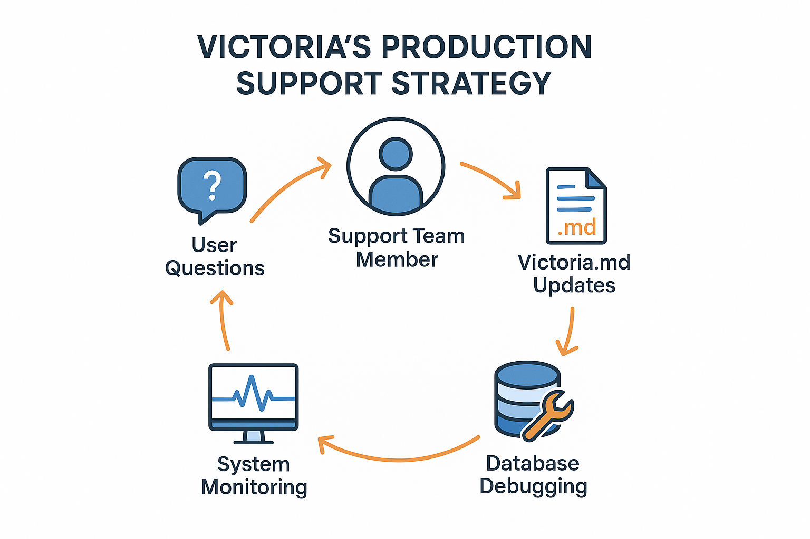

# Victoria

*Meet Victoria, Elcano's sophisticated AI agent who transforms complex programmatic advertising into navigable opportunities for performance and growth.*

Victoria is your intelligent assistant for programmatic advertising analysis. Simply ask questions about your campaign data in plain English, and Victoria will analyze your CSV files and data warehouse to provide actionable insights.

## ✨ What Victoria Does

Victoria is Elcano's intelligent AI agent named after the ship that completed the first circumnavigation under Juan Sebastián Elcano. She embodies the pioneering spirit of exploration and navigation, but in the digital realm of programmatic advertising.

**Core Capabilities:**
- **Analyze Your Data**: Drop in CSV/Excel files and ask questions like "Which campaigns have the best ROI?"
- **Expert Knowledge**: Knows all major ad tech metrics (CTR, CPC, CPM, CPA, ROAS) and industry benchmarks
- **Enterprise Ready**: Connects to Snowflake data warehouses with automatic database and schema exploration
- **Natural Language Analytics** - Ask questions in plain English, get instant insights
- **Real-Time Optimization** - Proactive recommendations based on comprehensive data analysis  
- **Fraud Detection** - Advanced pattern recognition to identify threats and anomalies
- **Human-in-the-Loop** - AI insights guided by expert human judgment
- **Strategic Intelligence** - Data-driven recommendations for campaign optimization

## 🎯 Strategic Vision & Architecture Philosophy

### Why We Built Victoria This Way

Victoria's architecture reflects a deliberate strategic decision to embrace the rapidly evolving AI agent ecosystem rather than building everything from scratch. Our philosophy centers on three core principles that guide every architectural decision and development choice.

**Avoiding Custom Model Lock-in**

We deliberately chose not to fine-tune custom models or build proprietary AI systems. The AI landscape is moving at unprecedented speed, with new models, capabilities, and breakthroughs emerging monthly. By avoiding custom model development, we maintain the flexibility to adopt the best available AI technologies as they emerge, rather than being locked into yesterday's solutions.

**Keeping Humans in the Loop**

Victoria is designed as an intelligent assistant, not a replacement for human expertise. We believe that the most effective advertising optimization comes from combining AI-powered insights with human creativity, strategic thinking, and market understanding.

**Building for Rapid Evolution**

The AI agent technology landscape is nascent and evolving rapidly. New frameworks, tools, and capabilities emerge constantly, and we expect significant changes in the ecosystem over the coming months and years. Rather than betting on a single platform or approach, Victoria's architecture is designed for adaptability and quick iteration.

### The "Tires, Not the Car" Approach

Our architectural philosophy can be summarized as building the tires rather than the entire car. We focus on the critical interface points where our domain expertise in advertising analytics creates the most value, while leveraging existing open-source projects for the foundational infrastructure.

**What We Build (The Tires)**

Victoria's core value lies in the specialized components that connect general-purpose AI agents to advertising data and workflows. This includes the Victoria.md knowledge base that encodes advertising domain expertise, the data connectors that integrate with advertising platforms and data warehouses, and the optimization logic that translates AI insights into actionable campaign recommendations.

**What We Leverage (The Engine)**

For the foundational AI capabilities, we leverage existing open-source projects and commercial platforms that have received massive investment and development resources. This includes large language models from major AI companies, agent frameworks like those provided by Anthropic, Google, and Charm, and data processing tools like DuckDB and Snowflake.

## 🏗️ System Architecture

Victoria's modular architecture enables flexible deployment across different AI agents while maintaining consistent functionality. The system consists of three main layers:

**Auto-Optimization aka YOLO Layer** (Optional): MCP (Model Context Protocol)  tooling allows us to connect to APIs and make optimizations on the fly in "YOLO mode".

**AI Agent Layer**: Choose from Crush, Claude Code, gemini-cli or any new and fancy AI agent based on your preferences and requirements. Each agent provides the same core Victoria functionality through different interfaces.

**Victoria Core**: The central orchestration layer that manages the Victoria.md knowledge base and facilitates coordination between AI agents and data sources.

**MCP Layer**: MCP servers allow us to connect to many data sources and allow us to add new tooling in a modular way to any AI agent that supports it. 

**Data Layer**: Victoria connects EVERYWHERE - Snowflake, CSV files, BigQuery, and other SQL-compatible systems.

## 🗺️ Product Roadmap

### Phase 1: Trader Terminal Agent Foundation (Current Focus)

The initial Victoria implementation focuses on terminal-based AI agents that provide powerful analytics capabilities through a command-line interface. This approach offers rapid development, local deployment advantages, and immediate value for technical users.

### Phase 2: Automated Agents (YOLOs)

Specialized versions for demonstration and automation use cases, including sample datasets, guided tutorials, and scheduled analysis capabilities.

### Phase 3: Web Platform, PWAs and/or Mobile Apps

A comprehensive web platform at elcanotek.com with user accounts, web-based data upload, enterprise features, and team collaboration capabilities.

Mobile applications starting with Progressive Web Apps and potentially expanding to native iOS/Android applications for on-the-go campaign monitoring.

## 🔑 Key Features (Current and Planned)

### For user flow diagram see [Victoria User Workflow](./images/victoria_user_workflow.png)

### 💬 Conversational Analytics

Instead of building complex reports, simply ask Victoria questions like:
- "Which supply partners have the highest viewability for automotive campaigns?"
- "Show me conversion rate trends across CTV inventory this month"
- "What's driving the decline in mobile performance?"
- "Calculate CTR for each campaign"
- "Show me performance trends over the last 30 days"
- "Which audiences have the highest conversion rate?"
- "Find campaigns with CTR below 0.1%"
- "What should I optimize first?"

Victoria processes these queries instantly, generating charts, tables, and actionable insights through her conversational intelligence capabilities.

*Victoria's intuitive conversational interface enables natural language queries that generate immediate, sophisticated analytics with charts, tables, and actionable insights.*

### 🛡️ Advanced Threat Detection & Quality Assessment

Victoria continuously monitors for fraud patterns, bot networks, and suspicious traffic using machine learning techniques that adapt to emerging threats. When anomalies are detected, she provides detailed analysis and recommended actions.

**Fraud Detection Capabilities:**
- Identify suspicious traffic patterns or quality issues
- Flag potential fraud indicators in the data
- Assess inventory quality across different sources
- Recommend brand safety improvements
- Advanced pattern recognition for emerging threats

*Victoria's advanced fraud detection capabilities identify suspicious patterns, bot networks, and anomalous traffic in real-time, providing comprehensive protection against sophisticated threats.*

### 🤝 Human-in-the-Loop-Unless-You-Wanna-YOLO Optimization

Victoria doesn't need to replace human expertise—she can amplify it. The core optimization workflow combines AI-powered analysis with human strategic thinking, creating a collaborative approach that delivers superior results.

**Optimization Approach:**
1. **Start with the big picture** - Overall performance trends and key metrics
2. **Drill down systematically** - Examine performance by dimensions (time, geography, device, etc.)
3. **Identify actionable insights** - Focus on findings that can drive optimization decisions
4. **Provide specific recommendations** - Give concrete next steps, not just observations
5. **Quantify impact** - Use data to estimate potential performance improvements

*Victoria's human-in-the-loop optimization workflow demonstrates the collaborative process where AI insights combine with human expertise to drive superior programmatic performance.*

### 📊 Data Sources & Integration

Victoria analyzes programmatic advertising data from multiple sources:
- Campaign performance metrics from major DSPs
- Supply-side data from premium exchanges
- Audience and targeting data
- Creative performance analytics
- Fraud detection and quality metrics

All data is processed through secure ETL pipelines ensuring data integrity and real-time availability for analysis.

### 🤔 Real-Time Performance Management

Victoria's provides comprehensive monitoring across all campaign dimensions, with intelligent alerts and optimization recommendations that help teams stay ahead of performance issues.

*Victoria's comprehensive performance dashboard provides real-time monitoring, intelligent insights, and actionable optimization recommendations across all campaign dimensions.*

## 🛠️ Current Configurations

* Most of Victoria's configuration happens in [VICTORIA.md](./VICTORIA.md), see the latest config there.
* You may also browse specific configuration repositories at [Elcano's Github](https://github.com/orgs/ElcanoTek/repositories). 

## 🔧 Production Support Strategy

### Daily Support Rotation

We implement a daily production support rotation where team members take responsibility for:
- User assistance and query optimization
- Victoria.md knowledge base improvements
- Database connection debugging
- System monitoring and issue resolution

### Testing and Quality Assurance

Comprehensive testing covers:
- Database connections across all supported platforms
- MCP server integration and compatibility
- Data quality monitoring and validation
- Performance optimization for large datasets